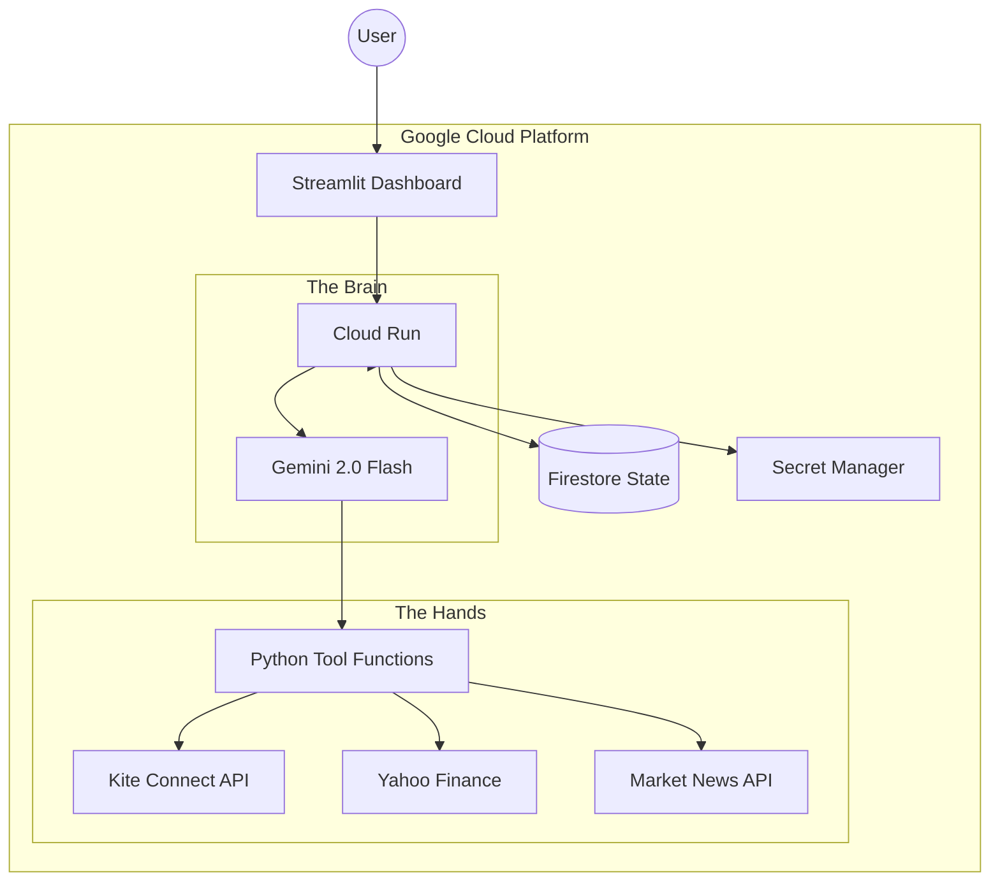
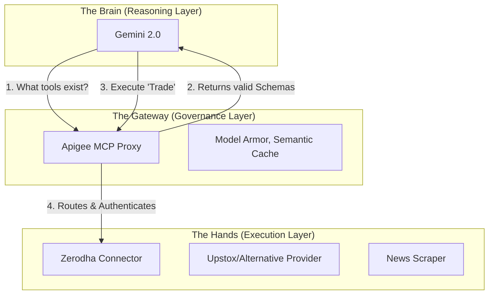

# System Architecture

The Intelligent Zerodha Investment Agent is designed with a strict **Separation of Concerns**, ensuring that AI reasoning never interferes with deterministic execution logic.

## High-Level Architecture

## Core Components

### 1. The Dashboard (UI/UX)
- **Technology**: Streamlit / Python.
- **Role**: Serves as the Command Center. Provides real-time analytics, risk profiling, and the **Human-in-the-Loop** approval interface.
- **Security**: Hardened via `ALLOWED_USER_ID` pinning and Cloud Run IAM.

### 2. The Agent Reasoning (Brain)
- **Technology**: Vertex AI (Gemini 2.0 Flash).
- **Role**: High-speed news digestion and risk modeling. It applies the "Cynical Risk Manager" protocol to every ticker in the universe.
- **Logic Sync**: Every run generates a full JSON research report for the 30-stock universe, which is persisted to Firestore.

### 3. The Tool Layer (Hands)
- **Role**: Deterministic execution. The AI performs the "Thinking," but these functions perform the "Doing" (Fetching prices, calculating exact order quantities, placing trades).
- **Integrations**:
    - **Kite Connect**: Order placement and portfolio fetching.
    - **yfinance**: Real-time pricing and historical data.
    - **DDG Search**: Decentralized news correlation.

### 4. State Management
- **Firestore**: Tracks the "Pending Orders" lifecycle (`DRAFT` -> `QUEUED` -> `EXECUTED`).
- **Secret Manager**: Securely stores API keys, tokens, and PII (emails).

## Data Flow: The Analysis Loop
1. User clicks **"Run Agent Analysis"**.
2. Dashboard triggers the Agent Logic Stream.
3. Agent fetches news for all 30 tickers in parallel.
4. Agent applies risk scoring based on Governance/Macro news.
5. Agent filters for financial health.
6. Agent calculates suggested quantities based on the global budget.
7. Agent saves a comprehensive Research Report to Firestore.
8. Dashboard refreshes to show refined AI Signals and Insights.

## The MCP Evolution: AI-First Gateway Architecture

With Phase 2, we moved from **Direct Function Calling** to a **Model Context Protocol (MCP)** architecture managed by Apigee. 

### What is MCP?
Modern LLMs (Gemini, Claude, etc.) use the Model Context Protocol to bridge the gap between AI reasoning and external data/tools. It standardizes two main workflows:
1.  **Selection (`list_tools`)**: The AI asks "What can you do?" and gets a standardized schema.
2.  **Execution (`call_tool`)**: The AI sends a request to execute a specific capability.

### The Role of Apigee as an MCP Gateway
Instead of the "Brain" (Gemini) talking directly to Python functions, it talks to a **Unified MCP Endpoint** on Apigee.

### Why does this matter? (The "Provider Swap" Scenario)

If we wanted to add a second broker (e.g., **Upstox**) or switch away from Zerodha, the architecture handles it gracefully:

1.  **Stable AI Interface**: The "Brain" still sees a `execute_trade` tool. The schema doesn't change.
2.  **Gateway Routing**: We add a new `TargetEndpoint` in Apigee for Upstox.
3.  **Conditional Execution**: Apigee can route based on headers, user ID, or weighted distribution (e.g., 50% Zerodha, 50% Upstox) without the AI even knowing the backend has changed.
4.  **Backend Normalization**: If Upstox's API requires different fields, the Python function (The Hands) handles the transformation, keeping the Gateway interface pure.

### Security & Governance
- **No Direct Access**: Tools are never exposed to the public internet. Only the Gateway holds the identity (`GoogleIDToken`) to invoke them.
- **AI-Informed Guardrails**: Apigee can use its "Generative AI Policies" to inspect the *intent* of a tool call before it reaches the financial backend.

> [!IMPORTANT]
> This architecture transforms the project from a "Trading App" into an "Investment Execution Grid" where providers are plug-and-play components.

