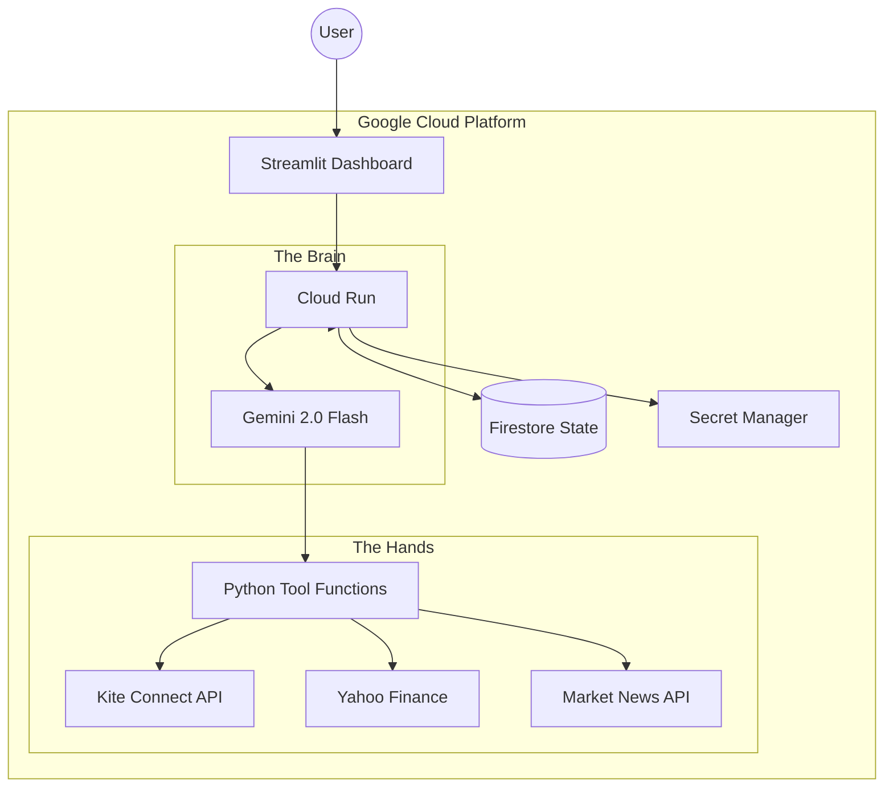

# System Architecture

The Intelligent Zerodha Investment Agent is designed with a strict **Separation of Concerns**, ensuring that AI reasoning never interferes with deterministic execution logic.

## High-Level Architecture

## Core Components

### 1. The Dashboard (UI/UX)
- **Technology**: Streamlit / Python.
- **Role**: Serves as the Command Center. Provides real-time analytics, risk profiling, and the **Human-in-the-Loop** approval interface.
- **Security**: Hardened via `ALLOWED_USER_ID` pinning and Cloud Run IAM.

### 2. The Agent Reasoning (Brain)
- **Technology**: Vertex AI (Gemini 2.0 Flash).
- **Role**: High-speed news digestion and risk modeling. It applies the "Cynical Risk Manager" protocol to every ticker in the universe.
- **Logic Sync**: Every run generates a full JSON research report for the 30-stock universe, which is persisted to Firestore.

### 3. The Tool Layer (Hands)
- **Role**: Deterministic execution. The AI performs the "Thinking," but these functions perform the "Doing" (Fetching prices, calculating exact order quantities, placing trades).
- **Integrations**:
    - **Kite Connect**: Order placement and portfolio fetching.
    - **yfinance**: Real-time pricing and historical data.
    - **DDG Search**: Decentralized news correlation.

### 4. State Management
- **Firestore**: Tracks the "Pending Orders" lifecycle (`DRAFT` -> `QUEUED` -> `EXECUTED`).
- **Secret Manager**: Securely stores API keys, tokens, and PII (emails).

## Data Flow: The Analysis Loop
1. User clicks **"Run Agent Analysis"**.
2. Dashboard triggers the Agent Logic Stream.
3. Agent fetches news for all 30 tickers in parallel.
4. Agent applies risk scoring based on Governance/Macro news.
5. Agent filters for financial health.
6. Agent calculates suggested quantities based on the global budget.
7. Agent saves a comprehensive Research Report to Firestore.
8. Dashboard refreshes to show refined AI Signals and Insights.
