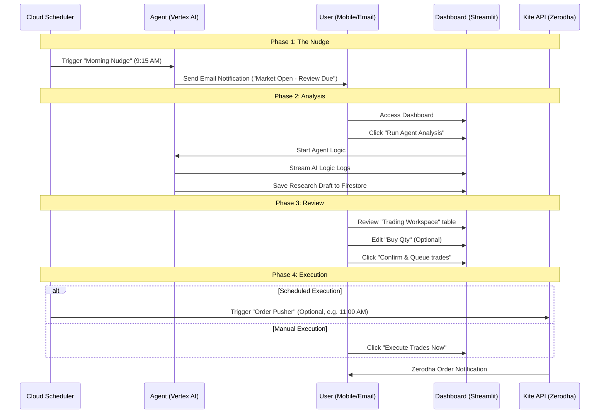

# Application Lifecycle & User Flow

The Intelligent Zerodha Investment Agent follows a strict **Human-in-the-Loop (HITL)** operational model. This ensures that while research is automated, actual financial risk is always managed by the user.

## The Operational Loop

## 1. Automation Triggers

### A. The "Morning Nudge" (Cloud Scheduler)
- **Schedule**: Weekdays at 09:15 IST.
- **Function**: `trigger-nudge`
- **Output**: Sends an email to the `RECIPIENT_EMAIL` notifying them that the market is open and the agent is ready for the day's analysis.

### B. The "Order Pusher" (Cloud Scheduler - Optional)
- **Schedule**: Weekdays at 11:00 IST.
- **Function**: `morning-execution`
- **Logic**: Automatically scans Firestore for orders in the `QUEUED` state. If found, it pushes them to the Zerodha trade book.

## 2. Customizing the Schedule ⚙️
You are not locked into the default timings. Because the infrastructure is defined via **Terraform**, you can easily modify the execution windows to suit your time zone or trading strategy:
- **Location**: `terraform/scheduler.tf` (or equivalent Cloud Scheduler resources).
- **Modification**: Update the `schedule` cron expression (e.g., changing `15 9 * * 1-5` to your preferred time).
- **Deployment**: Simply run `.\deploy.ps1` or `./deploy.sh` after changing the cron string to apply the new schedule globally.

## 3. Order States & Transitions

The system uses Firestore to track the lifecycle of every trade suggestion:

| State | Occurs when... | User Action |
| :--- | :--- | :--- |
| **DRAFT** | Agent completes analysis. | Table is editable. AI columns are populated. |
| **QUEUED** | User clicks "Confirm & Queue". | Table becomes **Read-Only**. Snapshot is saved. |
| **EXECUTED** | Trade successfully sent to Zerodha. | Status marked as complete. |
| **CANCELLED** | User clicks "Cancel & Edit". | Orders deleted. UI returns to editable DRAFT. |

## 3. Human-in-the-Loop Principles
- **No Invisible Trades**: The agent cannot place an order without a user first entering the dashboard and "Confirming" the draft.
- **Explainable Decisions**: Every suggestion is accompanied by an "AI Insight" detailing the exact news and fundamentals that drove the signal.
- **Quantity Override**: The user can override the AI's suggested quantity to match their personal risk appetite before queuing the trade.
